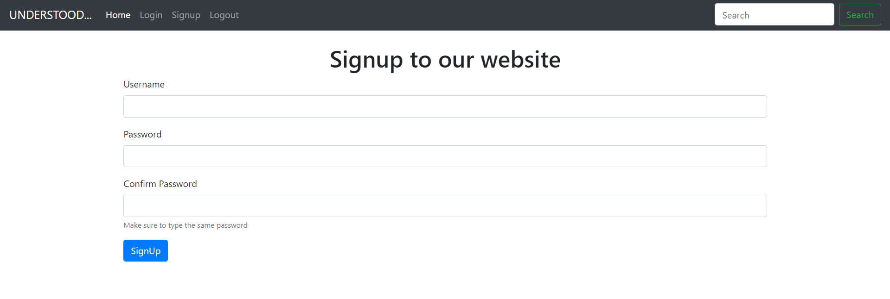

# PHP_LOGIN-CREATE_FORM

## PHP Project 

# Prerequisites
- Php
- MySQL

## Installation
Install the dependencies and start the server.

vscode
xampp server

## Development

Want to contribute? Great!

Make a change in your file and instantaneously see your updates!

# Screenshot

